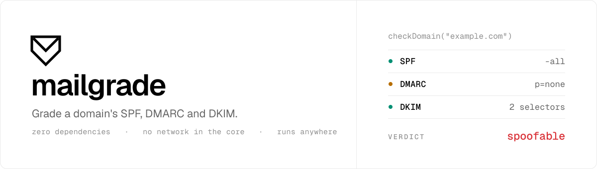

<p align="center">
  <picture>
    <source media="(prefers-color-scheme: dark)" srcset="./.github/assets/banner-dark.svg">
    
  </picture>
</p>

<p align="center">
  <a href="https://www.npmjs.com/package/mailgrade"></a>
  <a href="https://bundlephobia.com/package/mailgrade"></a>
  <a href="./LICENSE"></a>
</p>

<p align="center">
  Grade and verify SPF, DKIM and DMARC.<br>
  Zero dependencies. Runs wherever <code>fetch</code> and WebCrypto do: Node, Bun, Deno, Cloudflare Workers, browsers.
</p>

<p align="center">
  <a href="#grade-a-domain">Grade a domain</a> &nbsp;&middot;&nbsp;
  <a href="#verify-a-message">Verify a message</a> &nbsp;&middot;&nbsp;
  <a href="#triage-pasted-headers">Triage headers</a> &nbsp;&middot;&nbsp;
  <a href="#dmarc-records">DMARC records</a> &nbsp;&middot;&nbsp;
  <a href="#compared">Compared</a>
</p>

```sh
npm i mailgrade
```

## Grade a domain

Is this domain spoofable, and what is the fix?

```ts
import { checkDomain } from "mailgrade/doh";

const grade = await checkDomain("acme.com");

grade.verdict;            // "spoofable" | "partial" | "protected"
grade.dmarc.headline;     // "DMARC is monitoring only (p=none)"
grade.recommendations[0]; // { id: "graduate-dmarc", text: "Graduate DMARC from p=none. ..." }
```

DNS goes over DNS-over-HTTPS by default, against Cloudflare. Swap it:

| To resolve with | Pass |
| --- | --- |
| Another DoH provider | `{ endpoint }` |
| The system resolver | `{ resolver: nodeResolver() }` from `mailgrade/node-dns` |
| Anything else | `{ resolver }`, any `(name, type) => Promise<string[]>` |
| Nothing at all | `gradeDomain({ domain, txt, dmarc, ... })`, records you already hold |

> [!NOTE]
> One `checkDomain` is about 21 lookups: three records, plus a probe per DKIM
> selector. Public DoH endpoints publish no rate limit and throttle bulk
> traffic from one IP at their discretion, so for volume trim `selectors`,
> lower `concurrency`, or resolve through `mailgrade/node-dns`. An HTTP 429
> arrives as `DnsError`; backoff is yours to add.

## Verify a message

For when you are the receiver: a Workers email handler, an inbound webhook, an
SMTP server.

```ts
import { verifyMessage, toAuthResults } from "mailgrade/verify";
import { dohResolver } from "mailgrade/doh";

const result = await verifyMessage(rawMessage, {
  resolver: dohResolver(),
  ip: "203.0.113.50",           // who connected
  sender: "bounce@example.com", // MAIL FROM
});

result.dmarc?.result;      // "pass" | "fail" | "none"
result.dmarc?.disposition; // "none" | "quarantine" | "reject"

toAuthResults(result, "mx.acme.com");
// "mx.acme.com; spf=pass smtp.mailfrom=bounce@example.com; dkim=pass header.d=..."
```

SPF is evaluated against the connecting IP (RFC 7208, macros and lookup limits
included), DKIM signatures are verified with WebCrypto (rsa-sha256 and
ed25519-sha256; rsa-sha1 and sub-1024-bit keys refused per RFC 8301), and DMARC
alignment ties them to the From domain. `verifySpf`, `verifyDkim` and
`verifyDmarc` are also standalone calls. A DNS failure is always a `temperror`,
never a `fail`. In tests, `staticResolver({ "example.com": { TXT: [...] } })`
evaluates against a plain object.

> [!IMPORTANT]
> Where a verdict decides whether mail is delivered, pass `{ publicSuffixes }`
> too. The built-in list is an approximation, and it under-reports alignment
> rather than over-reporting it. [Why](#alignment-and-the-public-suffix-list).

## Triage pasted headers

For "is this email real": no cryptography, no I/O. A pasted header block
carries private data and never leaves the process.

```ts
import { analyzeHeaders } from "mailgrade/headers";

const result = analyzeHeaders(paste);

result.verdict;     // "suspicious" | "inconclusive" | "authentic"
result.spf.aligned; // false, the pass was for somebody else's domain
result.flags.map((f) => f.id);
// ["dmarc-fail", "reply-to-mismatch", "return-path-mismatch", "php-origin"]
```

Reads the verdicts the receiving server recorded, adds alignment, and flags
display-name tricks, lookalike domains, punycode, hidden characters and
redirected replies.

## DMARC records

```ts
import { buildDmarcRecord, reviewDmarc, rolloutPlan } from "mailgrade/dmarc";

const options = {
  domain: "acme.com", policy: "reject", subdomainPolicy: "none",
  rua: ["dmarc@acme.com"], ruf: [], pct: 100,
  adkim: "r", aspf: "r", ri: 86400, fo: "0",
} as const;

buildDmarcRecord(options); // "v=DMARC1; p=reject; sp=none; rua=mailto:dmarc@acme.com"
reviewDmarc(options)[0];   // { id: "sp-weaker", severity: "high", ... }
rolloutPlan(options);      // four staged records, monitoring to full reject
```

## Compared

| | `mailgrade` | [`mailauth`](https://github.com/postalsys/mailauth) | [`spf-check`](https://www.npmjs.com/package/spf-check) | [`dkim`](https://www.npmjs.com/package/dkim) |
| --- | :-: | :-: | :-: | :-: |
| Grade a domain, with fixes | ✓ | ✗ | ✗ | ✗ |
| SPF, DKIM and DMARC verification | ✓ | ✓ | SPF only | DKIM only |
| Analyze pasted headers | ✓ | ✗ | ✗ | ✗ |
| DMARC record tooling | ✓ | ✗ | ✗ | ✗ |
| ARC and BIMI | ✗ | ✓ | ✗ | ✗ |
| DNS transport | DoH or `node:dns` | `node:dns` | `node:dns` | `node:dns` |
| Workers / browsers / Deno | ✓ | ✗ | ✗ | ✗ |
| Runtime dependencies | **0** | 10 | 4 | 2 |
| Install size | **0.4 MB** | 15 MB | 7 MB | 1 MB |

<details>
<summary>Full matrix, and when to use something else</summary>

<br>

| | `mailgrade` | `mailauth` | `spf-check` | `dkim` |
| --- | :-: | :-: | :-: | :-: |
| SPF evaluation (RFC 7208) | ✓ | ✓ | ✓ | ✗ |
| DKIM verification | ✓ | ✓ | ✗ | ✓ |
| DMARC discovery and alignment | ✓ | ✓ | ✗ | ✗ |
| Authentication-Results output | ✓ | ✓ | ✗ | ✗ |
| SPF lookup limits enforced | 10 + 2 void | 10 + 2 void | 10 | n/a |
| Bring-your-own resolver | ✓ | ✓ | ✗ | ✗ |
| Written in TypeScript | ✓ | ✗ | ✗ | ✗ |
| Types | generated | hand-written | ✗ | hand-written |
| Published format | ESM + CJS | CJS | CJS | CJS |
| Last published | current | current | 2019 | 2022 |

Sizes are `npm install` into an empty project, measured 2026-08.

**Use [`mailauth`](https://github.com/postalsys/mailauth)** for a high-volume
Node MTA, or when you need ARC or BIMI. No ARC has a consequence worth stating
plainly: mail that arrived through a forwarder or a mailing list has usually
had its SPF broken and its body rewritten, so DMARC fails here exactly as it
does at any receiver that ignores ARC. Honest for a grader, a real gap for an
inbox.

**Use [`parsedmarc`](https://github.com/domainaware/parsedmarc)** to parse
DMARC aggregate reports. That is not this library's job.

</details>

## Entry points

| Import | What is in it |
| --- | --- |
| `mailgrade` | everything below except `doh` and `node-dns` |
| `mailgrade/verify` | `verifyMessage`, `verifySpf`, `verifyDkim`, `verifyDmarc`, `toAuthResults`, `staticResolver` |
| `mailgrade/headers` | `analyzeHeaders` and its parsers |
| `mailgrade/dmarc` | build, parse, review and roll out a record |
| `mailgrade/spf` | `analyzeSpf`, `isSpfRecord` |
| `mailgrade/dkim` | `analyzeDkim`, `isDkimKey`, `dkimHost`, `DKIM_SELECTORS` |
| `mailgrade/domain` | `registrableDomain`, `aligns`, `coerceDomain` |
| `mailgrade/doh` | `checkDomain`, `resolveDomain`, `dohResolver`. The only code that opens a socket |
| `mailgrade/node-dns` | `nodeResolver`. The only code that imports a Node built-in |

## Notes that matter

- **Ids are the contract.** Every finding carries a stable `id` next to its
  English. Branch on ids; swap or translate the prose freely.
- **The rules are portable.** They live as a language-neutral JSON corpus in
  [`spec/`](./spec). A port passes the same files; the TypeScript adapter is
  about 150 lines.

<h4 id="alignment-and-the-public-suffix-list">Alignment and the public suffix list</h4>

Alignment needs a public suffix list, and the built-in rules are an
approximation: known two-label suffixes, plus the registry's own labels (`co`,
`gov`, `ac`, `org`) under any country code. They err toward reading a host as
*more* specific than it is, so alignment is under-reported rather than
over-reported. Pass `{ publicSuffixes }`, the ICANN section of the real list,
to `verifyMessage`, `verifyDmarc`, `registrableDomain` or `aligns` wherever a
wrong answer costs something.

## About

Built and maintained by [Fallax](https://fallax.io), phishing simulations and
security awareness training on autopilot. MIT licensed.
